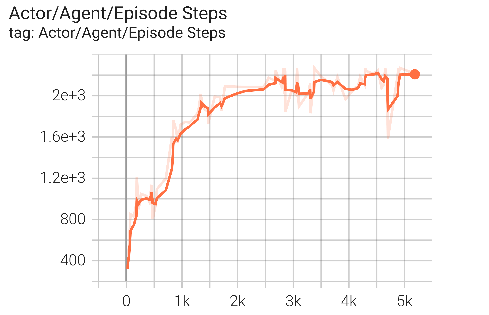

# Atari Environments

## Impala

### Pong-v5

Training by executing following command:

```bash
python examples/atari/impala.py --task_id Pong-v5 --learning_rate 1e-3
```

**Reward curve**


### Breatout-v5

Training by executing following command:

```bash
python examples/atari/impala.py --task_id Breakout-v5 --learning_rate 1e-3
```

**Reward curve**


### Seaquest-v5

Training by executing following command:

```bash
python examples/atari/impala.py --task_id Seaquest-v5 --entropy_coef 0.5
```

**Reward curve**




### SpaceInvaders-v5

Training by executing following command:

```bash
python examples/atari/impala.py --task_id SpaceInvaders-v5
```

**Reward curve**


