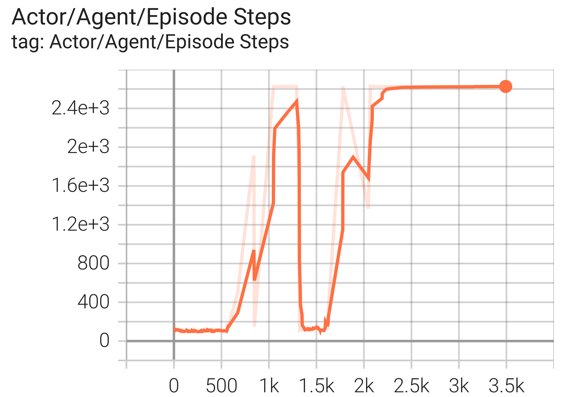

# Vizdoom Environments

## Installation

### apt-based distros (Ubuntu, Debian, Linux Mint, etc.)

To install ViZDoom run (may take few minutes):

```bash
apt install cmake git libboost-all-dev libsdl2-dev libopenal-dev
pip install vizdoom
```

## Impala

### D1_basic

Training by executing following command:

```bash
python examples/vizdoom/impala.py --map_id D1_basic
```

**Reward curve**


